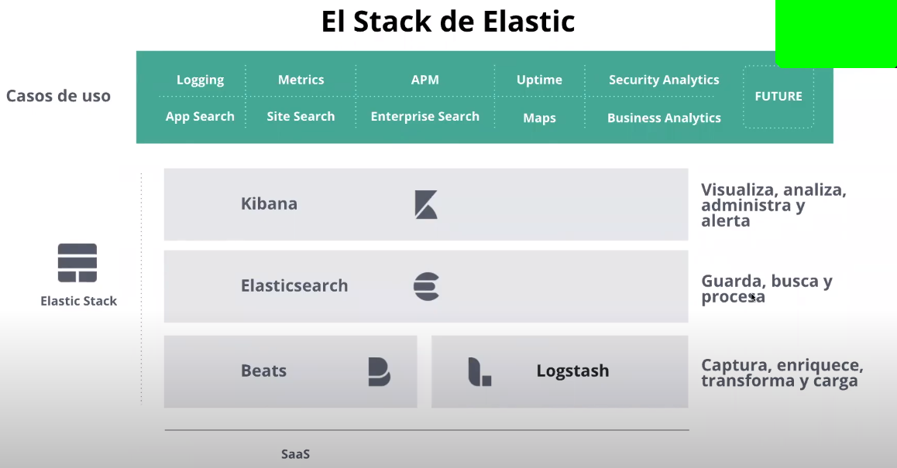
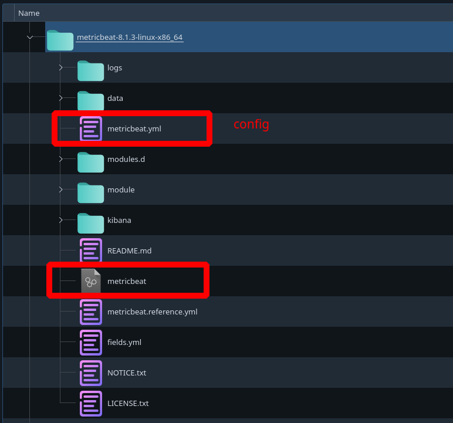

- [Elastic Stack - ELK](#elastic-stack---elk)
  - [Herramientas que forman elastic Stack](#herramientas-que-forman-elastic-stack)
    - [Kibana](#kibana)
    - [Elasticsearch](#elasticsearch)
    - [Logstash](#logstash)
    - [Beats](#beats)
  - [Instalación del stack](#instalación-del-stack)
    - [Logstash](#logstash-1)
    - [BEATS](#beats-1)
      - [USANDO `apt` (INSTALACIÓN EN NUESTRO SISTEMA)](#usando-apt-instalación-en-nuestro-sistema)
      - [BAJANDO EL .TAR.GZ - LA MÁS SENCILLA](#bajando-el-targz---la-más-sencilla)
      - [DOCKER](#docker)

# Elastic Stack - ELK

Es un conjunto de herramientas centradas en la monitorización y analítica de logs y explotación de infrormación en general. Exceptuando logstash, que está mñas centrada en logs, el resto se puede adaptar a explotar cualquier tipo de información. 

## Herramientas que forman elastic Stack



### Kibana

Herramienta de monitorización y visualización/explotación de información. Nos permite construir dashboards. 

### Elasticsearch 

Motor de búsqueda e indexación para localizar datos (almacenamiento de los datos). En el momento de almacenar esa info la indexa y por lo tanto la tiene que procesar de un cierto modo.

### Logstash 

Herramienta centrada en la gestión y tratamiento de logs. 

### Beats

Para recolección de información como: 

1. logs
2. sistema
3. red
4. base de datos 


## Instalación del stack 

### Logstash

Para que esta herramienta funcione correctamente debemos tener instalado JAVA. 

```
sudo apt install openjdk-16-jdk
export JAVA_HOME=/usr/lib/jvm/java-16-openjdk-amd64
export PATH=/usr/lib/jvm/java-16-openjdk-amd64/bin:${PATH}
```

### BEATS

Es un conjunto de herramientas que se instalan en un host y envian información a un destino concreto que suele ser logstash o elasticsearch. Oficialmente se ofrecen 6 beats: 

1. Filebeat   -> log files
2. Metricbeat -> metrics
3. Packetbeat -> network data 
4. winlogbeat -> windows event log 
5. Auditbeat  -> audir data
6. Heartbeat  -> Uptime Monitoring 


Procederemos a la instalación de uno en concreto ya que el resto se instalan igual. Posteriormente haremos la configuración necesaria. 

Vamos a instalar metricbeat, para ello debemos descargarlo del sitio oficial. Hay varias maneras de instalarlo:


#### USANDO `apt` (INSTALACIÓN EN NUESTRO SISTEMA)


source : https://www.elastic.co/guide/en/beats/metricbeat/8.1/setup-repositories.html#_apt

- Download and install the Public Signing Key:
```
wget -qO - https://artifacts.elastic.co/GPG-KEY-elasticsearch | sudo apt-key add -
```

- You may need to install the apt-transport-https package on Debian before proceeding:
  
```
sudo apt-get install apt-transport-https
```
- Save the repository definition to /etc/apt/sources.list.d/elastic-8.x.list:

```
echo "deb https://artifacts.elastic.co/packages/8.x/apt stable main" | sudo tee -a /etc/apt/sources.list.d/elastic-8.x.list
```
- Run apt-get update, and the repository is ready for use. For example, you can install Metricbeat by running:
```
sudo apt-get update && sudo apt-get install metricbeat
```
- To configure Metricbeat to start automatically during boot, run (OPTIONAL):

```
sudo systemctl enable metricbeat
#
sudo update-rc.d metricbeat defaults 95 10
```


- esto genera un script en la ruta `/usr/bin/metricbeat`

este script contiene las siguientes rutas:

```
exec /usr/share/metricbeat/bin/metricbeat \
  --path.home /usr/share/metricbeat \
  --path.config /etc/metricbeat \
  --path.data /var/lib/metricbeat \
  --path.logs /var/log/metricbeat \
```

- tenemos que configurar el archivo metricbeat.yml pq ahora solo queremos comprobar que el beat funciona así q modificamos la confi para q los mensajes los escriba en consola

```
vim /etc/metricbeat/metricbeat.yml
```
en la sección output comentamos q el output sea elastic search y añadimos
```
output.console:
  # Array of hosts to connect to.
    pretty: true
```
Finalmente para ejecutar el beat tenemos arrancar el ejecutable y pasarle el archivo de config

```
sudo /usr/share/metricbeat/bin/metricbeat -e -c /etc/metricbeat/metricbeat.yml
```

#### BAJANDO EL .TAR.GZ - LA MÁS SENCILLA

source: https://www.elastic.co/es/downloads/past-releases#metricbeat

Para podernos bajar el comprimido debemos ir a la sección de past-release, aquí nos podremos bajar el beat todo en un mismo directorio 



hacenos los cambios en el archivo de config y lo arrancamos

```
./metricbeat -c metricbeat.yml
```

#### DOCKER

```
docker pull docker.elastic.co/beats/metricbeat:8.1.3
```
