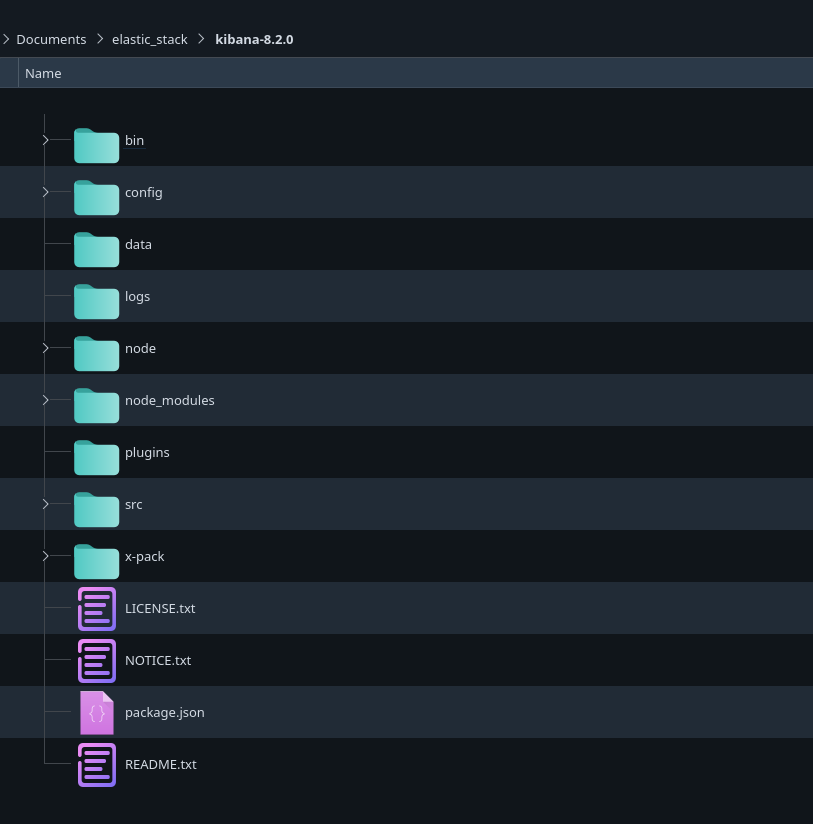
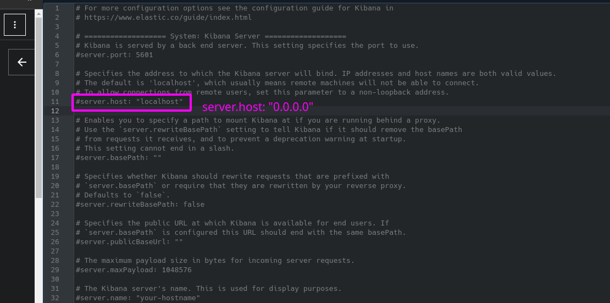

- [Elastic Stack - ELK](#elastic-stack---elk)
  - [Herramientas que forman elastic Stack](#herramientas-que-forman-elastic-stack)
    - [Kibana](#kibana)
    - [Elasticsearch](#elasticsearch)
    - [Logstash](#logstash)
    - [Beats](#beats)
  - [Instalación del stack](#instalación-del-stack)
    - [KIBANA](#kibana-1)
    - [ELASTICSEARCH](#elasticsearch-1)
    - [LOGSTASH](#logstash-1)
    - [BEATS](#beats-1)
      - [USANDO `apt` (INSTALACIÓN EN NUESTRO SISTEMA)](#usando-apt-instalación-en-nuestro-sistema)
      - [BAJANDO EL .TAR.GZ - LA MÁS SENCILLA](#bajando-el-targz---la-más-sencilla)
      - [DOCKER](#docker)
  - [Prueba de funcionamiento](#prueba-de-funcionamiento)

# Elastic Stack - ELK

Es un conjunto de herramientas centradas en la monitorización y analítica de logs y explotación de infrormación en general. Exceptuando logstash, que está mñas centrada en logs, el resto se puede adaptar a explotar cualquier tipo de información. 

## Herramientas que forman elastic Stack


### Kibana

Herramienta de monitorización y visualización/explotación de información. Nos permite construir dashboards. 

### Elasticsearch 

Motor de búsqueda e indexación para localizar datos (almacenamiento de los datos). En el momento de almacenar esa info la indexa y por lo tanto la tiene que procesar de un cierto modo.

### Logstash 

Herramienta centrada en la gestión y tratamiento de logs. 

### Beats

Para recolección de información como: 

1. logs
2. sistema
3. red
4. base de datos 


## Instalación del stack 

### KIBANA 

source: https://www.elastic.co/es/downloads/past-releases#kibana

desragamos el .tar tenemos la siguiente organización de directorios



Kibana requiere que tengamos un elasticsearch arrancado. Ya que kibana es un componente que hace de frontend para toda la info que hay en elasticsearch pero la propia información de kibana se guarda tb en elasticsearch.

En el fichero `config/kibana.yml`tenemos la configuración de kibana, para la primera vez lo dejaremos x defecto pq busca un elasticsearch que corra en `localhost:9200`

Antes de acceder a kibana en el archivo de configuración `kibana-8.2.0/config/kibana.yml` podemos poner q escuche peticiones desde cualqiuer IP 



para entrar en la interfaz de kibana nos dirigimos a `http://localhost:5601` y nos pedirá user y password (usamos como user elastic)

como antes he puesto q puedo acceder desde cualqiuer IP tb puedo usar la IP de mi máquina para acceder a kibana (mismo procedimiento q con localhost).

> Para entrar en Kibana GUI necesitamos entrar usando el usuario elastic de elasticsearch.


### ELASTICSEARCH

source: https://www.elastic.co/es/downloads/past-releases#elasticsearch

Descargamos el .tar descomprimimos y ejecutamos directamente


```
bin/elasticsearch -d

```
el -d es para arrancarlo como servicio y así no nos bloquea la terminal.

Elasticsearch publica dos endpoints:

https://localhost:9300 => utilizando el protocola trasport basado en TCP utilizado entre otras cosas para la comunicación entre los nodos

https:localhost:9200 => donde publica la API REST para las consultas a elasticsearch

Para poderme conectar debo hacerlo por el protocolo https, esto me abrirá un modal para introducir user (elastic) y password. Estos datos se proporcionan cuando arrancamos elasticsearch


y me devuelve lo siguiente 


Comandos importantes para elastic:

Todos los comandos debemos ejecutarlos desde la raíz del directorio de eslastic.

1. cear un enrollment token 

```
bin/elasticsearch-create-enrollment-token -s node
```

2. resetear el password de cualquier user de elastic (en este caso use elastic)

```
bin/elasticsearch-reset-password --username elastic
```


### LOGSTASH

Para que esta herramienta funcione correctamente debemos tener instalado JAVA. 

```
sudo apt install openjdk-16-jdk
export JAVA_HOME=/usr/lib/jvm/java-16-openjdk-amd64
export PATH=/usr/lib/jvm/java-16-openjdk-amd64/bin:${PATH}
```

si instalamos el jdk de oracle 

0. `sudo apt install software-properties-common`
1. bajamos el .deb de la web de oracle (https://www.oracle.com/java/technologies/downloads/)
2. sudo apt install ./jdk-xx-...
3. 
```
$ sudo update-alternatives --install /usr/bin/java java /usr/lib/jvm/jdk-14/bin/java 1
$ sudo update-alternatives --install /usr/bin/javac javac /usr/lib/jvm/jdk-14/bin/javac 1
```
4. `sudo update-alternatives --config java`
5. `sudo nano /etc/environment`
6. `JAVA_HOME="/usr/lib/jvm/jdk-14"`
7. `source /etc/environment`
8. `echo $JAVA_HOME`

Nos lo bajamos desde : https://www.elastic.co/es/downloads/past-releases#logstash

esto generará un directorio con el siguiente contenido:


en el directorio `bin` tendremos el ejecutable y en config encontramos la configuración básica tanto la q afecta a la JVM (java virtual machine) como a la confi propia de logstash como sus pipelines, etc...

Para ver que funciona correctamente haremos un configuración básica de un pipeline sencillo en la raíz del directorio 

```JSON
input {
 stdin {}
}
output{
 stdout {
  codec=> json_lines	// formatea el output
}
}
```
Para comprobarlo ejecutamos el binario pasandole este pipline 

```
bin/logstash -f example.conf 
```
esto arranca logstash y para comprobar que funciona escribimos como input algún mensaje y veremos como lo saca formateado como JSON 

```
david@david-main ~/Descargas/logstash-8.1.3 ❯ bin/logstash -f example.conf 
Using bundled JDK: /home/david/Descargas/logstash-8.1.3/jdk
OpenJDK 64-Bit Server VM warning: Option UseConcMarkSweepGC was deprecated in version 9.0 and will likely be removed in a future release.
Sending Logstash logs to /home/david/Descargas/logstash-8.1.3/logs which is now configured via log4j2.properties
[2022-05-08T10:56:38,929][INFO ][logstash.runner          ] Log4j configuration path used is: /home/david/Descargas/logstash-8.1.3/config/log4j2.properties
[2022-05-08T10:56:38,949][WARN ][logstash.runner          ] The use of JAVA_HOME has been deprecated. Logstash 8.0 and later ignores JAVA_HOME and uses the bundled JDK. Running Logstash with the bundled JDK is recommended. The bundled JDK has been verified to work with each specific version of Logstash, and generally provides best performance and reliability. If you have compelling reasons for using your own JDK (organizational-specific compliance requirements, for example), you can configure LS_JAVA_HOME to use that version instead.
[2022-05-08T10:56:38,950][INFO ][logstash.runner          ] Starting Logstash {"logstash.version"=>"8.1.3", "jruby.version"=>"jruby 9.2.20.1 (2.5.8) 2021-11-30 2a2962fbd1 OpenJDK 64-Bit Server VM 11.0.14.1+1 on 11.0.14.1+1 +indy +jit [linux-x86_64]"}
[2022-05-08T10:56:38,951][INFO ][logstash.runner          ] JVM bootstrap flags: [-Xms1g, -Xmx1g, -XX:+UseConcMarkSweepGC, -XX:CMSInitiatingOccupancyFraction=75, -XX:+UseCMSInitiatingOccupancyOnly, -Djava.awt.headless=true, -Dfile.encoding=UTF-8, -Djruby.compile.invokedynamic=true, -Djruby.jit.threshold=0, -Djruby.regexp.interruptible=true, -XX:+HeapDumpOnOutOfMemoryError, -Djava.security.egd=file:/dev/urandom, -Dlog4j2.isThreadContextMapInheritable=true, --add-opens=java.base/java.security=ALL-UNNAMED, --add-opens=java.base/java.io=ALL-UNNAMED, --add-opens=java.base/java.nio.channels=ALL-UNNAMED, --add-opens=java.base/sun.nio.ch=ALL-UNNAMED, --add-opens=java.management/sun.management=ALL-UNNAMED]
[2022-05-08T10:56:39,212][WARN ][logstash.config.source.multilocal] Ignoring the 'pipelines.yml' file because modules or command line options are specified
[2022-05-08T10:56:40,350][INFO ][logstash.agent           ] Successfully started Logstash API endpoint {:port=>9600, :ssl_enabled=>false}
[2022-05-08T10:56:40,733][INFO ][org.reflections.Reflections] Reflections took 70 ms to scan 1 urls, producing 120 keys and 419 values 
[2022-05-08T10:56:41,094][INFO ][logstash.codecs.jsonlines] ECS compatibility is enabled but `target` option was not specified. This may cause fields to be set at the top-level of the event where they are likely to clash with the Elastic Common Schema. It is recommended to set the `target` option to avoid potential schema conflicts (if your data is ECS compliant or non-conflicting, feel free to ignore this message)
[2022-05-08T10:56:41,129][INFO ][logstash.javapipeline    ] Pipeline `main` is configured with `pipeline.ecs_compatibility: v8` setting. All plugins in this pipeline will default to `ecs_compatibility => v8` unless explicitly configured otherwise.
[2022-05-08T10:56:41,226][INFO ][logstash.javapipeline    ][main] Starting pipeline {:pipeline_id=>"main", "pipeline.workers"=>16, "pipeline.batch.size"=>125, "pipeline.batch.delay"=>50, "pipeline.max_inflight"=>2000, "pipeline.sources"=>["/home/david/Descargas/logstash-8.1.3/example.conf"], :thread=>"#<Thread:0x24d8aa8c run>"}
[2022-05-08T10:56:42,052][INFO ][logstash.javapipeline    ][main] Pipeline Java execution initialization time {"seconds"=>0.82}
[2022-05-08T10:56:42,096][INFO ][logstash.javapipeline    ][main] Pipeline started {"pipeline.id"=>"main"}
The stdin plugin is now waiting for input:
[2022-05-08T10:56:42,144][INFO ][logstash.agent           ] Pipelines running {:count=>1, :running_pipelines=>[:main], :non_running_pipelines=>[]}


test

{"@timestamp":"2022-05-08T08:57:00.117837Z","host":{"hostname":"david-main"},"@version":"1","event":{"original":"test"},"message":"test"}

```


### BEATS

Es un conjunto de herramientas que se instalan en un host y envian información a un destino concreto que suele ser logstash o elasticsearch. Oficialmente se ofrecen 6 beats: 

1. Filebeat   -> log files
2. Metricbeat -> metrics
3. Packetbeat -> network data 
4. winlogbeat -> windows event log 
5. Auditbeat  -> audir data
6. Heartbeat  -> Uptime Monitoring 


Procederemos a la instalación de uno en concreto ya que el resto se instalan igual. Posteriormente haremos la configuración necesaria. 

Vamos a instalar metricbeat, para ello debemos descargarlo del sitio oficial. Hay varias maneras de instalarlo:


#### USANDO `apt` (INSTALACIÓN EN NUESTRO SISTEMA)


source : https://www.elastic.co/guide/en/beats/metricbeat/8.1/setup-repositories.html#_apt

- Download and install the Public Signing Key:
```
wget -qO - https://artifacts.elastic.co/GPG-KEY-elasticsearch | sudo apt-key add -
```

- You may need to install the apt-transport-https package on Debian before proceeding:
  
```
sudo apt-get install apt-transport-https
```
- Save the repository definition to /etc/apt/sources.list.d/elastic-8.x.list:

```
echo "deb https://artifacts.elastic.co/packages/8.x/apt stable main" | sudo tee -a /etc/apt/sources.list.d/elastic-8.x.list
```
- Run apt-get update, and the repository is ready for use. For example, you can install Metricbeat by running:
```
sudo apt-get update && sudo apt-get install metricbeat
```
- To configure Metricbeat to start automatically during boot, run (OPTIONAL):

```
sudo systemctl enable metricbeat
#
sudo update-rc.d metricbeat defaults 95 10
```


- esto genera un script en la ruta `/usr/bin/metricbeat`

este script contiene las siguientes rutas:

```
exec /usr/share/metricbeat/bin/metricbeat \
  --path.home /usr/share/metricbeat \
  --path.config /etc/metricbeat \
  --path.data /var/lib/metricbeat \
  --path.logs /var/log/metricbeat \
```

- tenemos que configurar el archivo metricbeat.yml pq ahora solo queremos comprobar que el beat funciona así q modificamos la confi para q los mensajes los escriba en consola

```
vim /etc/metricbeat/metricbeat.yml
```
en la sección output comentamos q el output sea elastic search y añadimos
```
output.console:
  # Array of hosts to connect to.
    pretty: true
```
Finalmente para ejecutar el beat tenemos arrancar el ejecutable y pasarle el archivo de config

```
sudo /usr/share/metricbeat/bin/metricbeat -e -c /etc/metricbeat/metricbeat.yml
```

#### BAJANDO EL .TAR.GZ - LA MÁS SENCILLA

source: https://www.elastic.co/es/downloads/past-releases#metricbeat

Para podernos bajar el comprimido debemos ir a la sección de past-release, aquí nos podremos bajar el beat todo en un mismo directorio 


hacenos los cambios en el archivo de config y lo arrancamos

```
./metricbeat -c metricbeat.yml
```

#### DOCKER

Si entramos en `https://www.docker.elastic.co/` veremos que tenemos imágenes para todo el stack de elastic. 

Vamos a generar un docker-compose para arrancar todos los componentes de una vez. 

```yml
version: "3.7"
services:
  elasticsearch:
    image: docker.elastic.co/elasticsearch/elasticsearch:7.6.0
    ulimits:
      memlock:
        soft: -1
        hard: -1
    environment:
      - bootstrap.memory_lock=true
      - "ES_JAVA_OPTS=-Xms512m -Xmx512m"
      - discovery.type=single-node
    volumes:
      - ./elasticsearch/data:/usr/share/elasticsearch/data
    ports:
      - 9200:9200
      - 9300:9300

  logstash:
    image: docker.elastic.co/logstash/logstash:7.6.0
    volumes:
      - ./logstash/pipeline:/usr/share/logstash/pipeline

  metricbeat:
    image: docker.elastic.co/beats/metricbeat:8.1.3
    user: root
    environment:
      ELASTICSEARCH_HOSTS: https://localhost:9200
      KIBANA_HOSTS: https://localhost:5601
    volumes:
      - ./metricbeat.docker.yml:/usr/share/metricbeat/metricbeat.yml"
      - /var/run/docker.sock:/var/run/docker.sock
      - /sys/fs/cgroup:/hostfs/sys/fs/cgroup
      - /proc:/hostfs/proc
      - /:/hostfs

  kibana:
    image: docker.elastic.co/kibana/kibana:7.6.0
    ports:
      - 5601:5601


```

Dentro de los contenedores las aplicaciones se encuentran en `/usr/share/elasticsearch/`

ara que elasticsearch funcione adecuadamente necesitamos que toda la configuración que se encuentra en el archivo elasticsearch.yml esté presente en el momento de arrancar el contenedor para ello utilizamos las variables de entorno. 
Otra alternativa es crear un fichero de configuración y cargarlo en un volumen para que sobreescriba el fichero en el volumen 

```yml
volumes:
      - ./elasticsearch/data:/usr/share/elasticsearch/data
      - ./elasticsearch/elasticsearch.yml:/usr/share/elasticsearch/config/elasticsearch.yml

```

lo mismo para kibana y logstash.

Aunque normalmente los beats no se instalan en contenedores sino directamente en la máquina que lo genera como hemos hecho anteriorment.

## Prueba de funcionamiento 

Nuestro fluja va a ser el siguiente 

